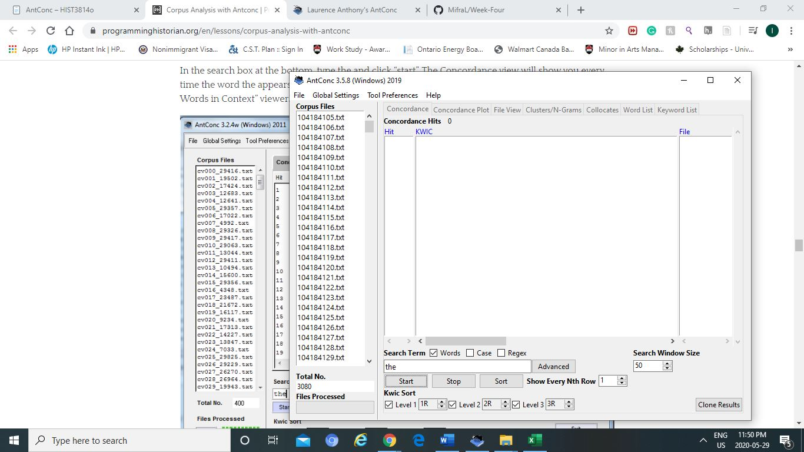

Excel and R:

Excel 
-	I tried saving by opening the tab, it canceled the file.
-	I tried saving it by right clicking it …
-	Went to site, then downloaded it there as a csv
-	The file after unzipping it has it already in excel 

R
-	It worked fine apart from having trouble opening the application = it usually happens to take a while 

Voyant 

-	My page is a bit different; I assume the link is not the correct one
-	There is no spark line in the trend section 
-	https://voyant-tools.org/?corpus=49f48aa297f23faaecb77e664a9f0650
-	<iframe style='width: 1366px; height: 569px;' src='https://voyant-tools.org/tool/Cirrus/?view=Cirrus&corpus=49f48aa297f23faaecb77e664a9f0650'></iframe>
- I took a break for a two days to try it again, but the site was not working. 
- with the new link provided by the prof @ https://service.sadilar.org/voyant/, it worked. 
- I realized the mistake was when I was choosing the option in the add text tab, I forget to change the documents to 'from cells in each row.' 
- https://service.sadilar.org/voyant/?corpus=9492212aae922de31dfffac6101cbc6d
- <iframe style='width: 452px; height: 300px;' src='https://service.sadilar.org/voyant/tool/Cirrus/?corpus=9492212aae922de31dfffac6101cbc6d'></iframe>

- To create my own corpus, I copied the links as mentioned by the prof and followed the procedure 
- https://service.sadilar.org/voyant/?corpus=26da7c79e061d1766419d3d61d55ec83
- <iframe style='width: 452px; height: 300px;' src='https://service.sadilar.org/voyant/tool/Trends/?query=honolulu&corpus=26da7c79e061d1766419d3d61d55ec83'></iframe>

Antconc

-	I think I downloaded the wrong file
-	Im confused about which one to use
-	I followed the steps and the names in the corpus files don’t look the same
-	When I did the search for shot it came out weird 
-	Took a break 
-	Redid the steps from the link 
-	When I searched the, other similar words were also highlighted 
-	I wrote the wrong word = sort in the tab and clicked sort so I think that messed up the findings
-	When I copied it into notepad, the shot word was not aligned as well the text file
-	Before, I made a mistake yesterday when I was doing the last step and I realized where I went wrong, I forget to add the directory in the tool preferences, So the key words had an issue
-	I also opened the wrong file 

Topic Modeling and R:

Topic modeling 
-	Issue with finding/choosing the correct directory for the input/output/metadata

With R
-	I had an error command

Bonus 

